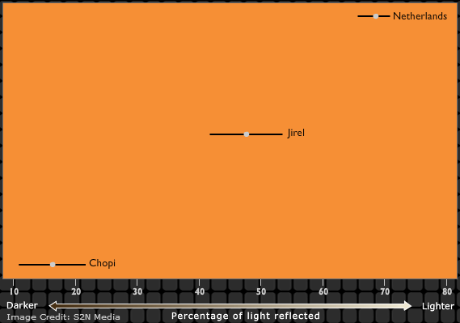

## Race: How many? {.vcenter}

## Race: What distinguishes them? {.vcenter}

## Sorting People

__Classification__

- American Indian (AI)
- Asian (A)
- Black (B)
- Hispanic/Latino (HL)
- White (W)

 
 

## Sorting People

__Classification__

- <b>American Indian (AI)</b>
- Asian (A)
- Black (B)
- Hispanic/Latino (HL)
- White (W)

 
 

## Sorting People

__Classification__

- American Indian (AI)
- Asian (A)
- Black (B)
- Hispanic/Latino (HL)
- White (W)

 
 

## Sorting People

__Classification__

- American Indian (AI)
- Asian (A)
- Black (B)
- <b>Hispanic/Latino (HL)</b>
- White (W)

 
 

## Sorting People

__Classification__

- American Indian (AI)
- Asian (A)
- Black (B)
- Hispanic/Latino (HL)
- White (W)

 
 

## Sorting People

__Classification__

- American Indian (AI)
- Asian (A)
- <b>Black (B)</b>
- Hispanic/Latino (HL)
- White (W)

 
 

## Sorting People

__Classification__

- American Indian (AI)
- Asian (A)
- Black (B)
- Hispanic/Latino (HL)
- White (W)

 
 

## Sorting People

__Classification__

- American Indian (AI)
- Asian (A)
- <b>Black (B)</b>
- Hispanic/Latino (HL)
- White (W)

 
 

## Sorting People

__Classification__

- American Indian (AI)
- Asian (A)
- Black (B)
- Hispanic/Latino (HL)
- White (W)

 
 

## Sorting People

__Classification__

- American Indian (AI)
- <b>Asian (A)</b>
- Black (B)
- Hispanic/Latino (HL)
- White (W)

 
 

## Sorting People

__Classification__

- American Indian (AI)
- Asian (A)
- Black (B)
- Hispanic/Latino (HL)
- White (W)

 
 

## Sorting People

__Classification__

- American Indian (AI)
- Asian (A)
- Black (B)
- <b>Hispanic/Latino (HL)</b>
- White (W)

 
 

## Sorting People

__Classification__

- American Indian (AI)
- Asian (A)
- Black (B)
- Hispanic/Latino (HL)
- White (W)

 
 

## Sorting People

__Classification__

- <b>American Indian (AI)</b>
- Asian (A)
- Black (B)
- Hispanic/Latino (HL)
- White (W)

 
 

## Sorting People

__Classification__

- American Indian (AI)
- Asian (A)
- Black (B)
- Hispanic/Latino (HL)
- White (W)

 
 

## Sorting People

__Classification__

- American Indian (AI)
- <b>Asian (A)</b>
- Black (B)
- Hispanic/Latino (HL)
- White (W)

 
 

## Sorting People

__Classification__

- American Indian (AI)
- Asian (A)
- Black (B)
- Hispanic/Latino (HL)
- White (W)

 
 

## Sorting People

__Classification__

- American Indian (AI)
- Asian (A)
- <b>Black (B)</b>
- Hispanic/Latino (HL)
- White (W)

 
 

## Sorting People

__Classification__

- American Indian (AI)
- Asian (A)
- Black (B)
- Hispanic/Latino (HL)
- White (W)

 
 

## Sorting People

__Classification__

- American Indian (AI)
- Asian (A)
- Black (B)
- <b>Hispanic/Latino (HL)</b>
- White (W)

 
 

## Sorting People

__Classification__

- American Indian (AI)
- Asian (A)
- Black (B)
- Hispanic/Latino (HL)
- White (W)

 
 

## Sorting People

__Classification__

- American Indian (AI)
- Asian (A)
- Black (B)
- Hispanic/Latino (HL)
- <b>White (W)</b>

 
 

## Sorting People

__Classification__

- American Indian (AI)
- Asian (A)
- Black (B)
- Hispanic/Latino (HL)
- White (W)

 
 

## Sorting People

__Classification__

- <b>American Indian (AI)</b>
- Asian (A)
- Black (B)
- Hispanic/Latino (HL)
- White (W)

 
 

## Sorting People

__Classification__

- American Indian (AI)
- Asian (A)
- Black (B)
- Hispanic/Latino (HL)
- White (W)

 
 

## Sorting People

__Classification__

- American Indian (AI)
- Asian (A)
- <b>Black (B)</b>
- Hispanic/Latino (HL)
- White (W)

 
 

## Sorting People

__Classification__

- American Indian (AI)
- Asian (A)
- Black (B)
- Hispanic/Latino (HL)
- White (W)

 
 

## Sorting People

__Classification__

- American Indian (AI)
- Asian (A)
- Black (B)
- Hispanic/Latino (HL)
- <b>White (W)</b>

 
 

## Sorting People

__Classification__

- American Indian (AI)
- Asian (A)
- Black (B)
- Hispanic/Latino (HL)
- White (W)

 
 

## Sorting People

__Classification__

- American Indian (AI)
- <b>Asian (A)</b>
- Black (B)
- Hispanic/Latino (HL)
- White (W)

 
 

## Sorting People

__Classification__

- American Indian (AI)
- Asian (A)
- Black (B)
- Hispanic/Latino (HL)
- White (W)

 
 

## Sorting People

__Classification__

- American Indian (AI)
- <b>Asian (A)</b>
- Black (B)
- Hispanic/Latino (HL)
- White (W)

 
 

## Sorting People

__Classification__

- American Indian (AI)
- Asian (A)
- Black (B)
- Hispanic/Latino (HL)
- White (W)

 
 

## Sorting People

__Classification__

- <b>American Indian (AI)</b>
- Asian (A)
- Black (B)
- Hispanic/Latino (HL)
- White (W)

 
 

## Sorting People

__Classification__

- American Indian (AI)
- Asian (A)
- Black (B)
- Hispanic/Latino (HL)
- White (W)

 
 

## Sorting People

__Classification__

- American Indian (AI)
- Asian (A)
- Black (B)
- Hispanic/Latino (HL)
- <b>White (W)</b>

 
 

## Sorting People

__Classification__

- American Indian (AI)
- Asian (A)
- Black (B)
- Hispanic/Latino (HL)
- White (W)

 
 

## Sorting People

__Classification__

- American Indian (AI)
- Asian (A)
- Black (B)
- Hispanic/Latino (HL)
- <b>White (W)</b>

 
 

## Sorting People

__Classification__

- American Indian (AI)
- Asian (A)
- Black (B)
- Hispanic/Latino (HL)
- White (W)

 
 

## Sorting People

__Classification__

- American Indian (AI)
- Asian (A)
- Black (B)
- <b>Hispanic/Latino (HL)</b>
- White (W)

 
 

## Classification Varies

## The Human Spectrum (of Skin Color) | Where do you draw the line? {.build .flexbox .vcenter}

## The Human Spectrum (of Skin Color) | Where do you draw the line? {.flexbox .vcenter}

## Sorting People

## How race has changed...the US Census

## How Race Has Changed:  The US Census | 1870 Census

__Color__

- White
- Black
- Mulatto
- Chinese
- Indian

## How Race Has Changed:  The US Census | 1950 Census

__Race__

- White
- Negro
- American Indian
- Japanese
- Chinese
- Filipino
- Other race

## How Race Has Changed:  The US Census | 2000 Census

__1. Is person Spanish/Hispanic/Latino (HL)?__

__2. What is the Person's race? Mark one <i>or more</i>  races.__

- White
- Black, African Am, or Negro
- American Indian or Alaskan Native (print name of enrolled tribe)
- Asian Indian
- Chinese
- Filipino
- Japanese

 
 

- Korean
- Vietnamese
- Native Hawaiian
- Guamanian or Chamorro
- Samoan
- Other Pacific Island (print race)
- Other Asian (print race)
- Some other race (print race)

