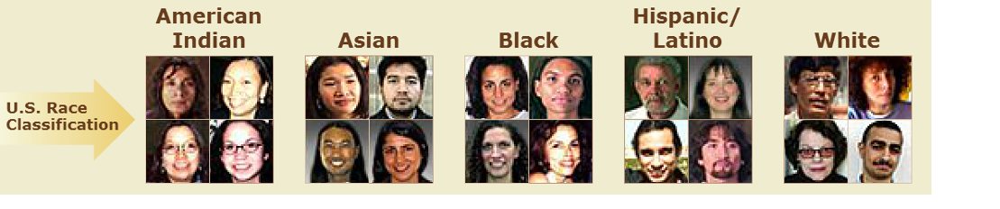

# Before We Begin...a Test Poll | Text your answer code to 22333.
## {.vcenter}

# Sorting People by Physical Appearance

## Sorting People #1

__Classification__

- American Indian (AI)
- Asian (A)
- Black (B)
- Hispanic/Latino (HL)
- White (W)

 
 

## Sorting People #1

__Classification__

- <b>American Indian (AI)</b>
- Asian (A)
- Black (B)
- Hispanic/Latino (HL)
- White (W)

 
 

## Sorting People #2

__Classification__

- American Indian (AI)
- Asian (A)
- Black (B)
- Hispanic/Latino (HL)
- White (W)

 
 

## Sorting People #2

__Classification__

- American Indian (AI)
- Asian (A)
- Black (B)
- <b>Hispanic/Latino (HL)</b>
- White (W)

 
 

## Sorting People #3

__Classification__

- American Indian (AI)
- Asian (A)
- Black (B)
- Hispanic/Latino (HL)
- White (W)

 
 

## Sorting People #3

__Classification__

- American Indian (AI)
- Asian (A)
- <b>Black (B)</b>
- Hispanic/Latino (HL)
- White (W)

 
 

## Sorting People #4

__Classification__

- American Indian (AI)
- Asian (A)
- Black (B)
- Hispanic/Latino (HL)
- White (W)

 
 

## Sorting People #4

__Classification__

- American Indian (AI)
- Asian (A)
- <b>Black (B)</b>
- Hispanic/Latino (HL)
- White (W)

 
 

## Sorting People #5

__Classification__

- American Indian (AI)
- Asian (A)
- Black (B)
- Hispanic/Latino (HL)
- White (W)

 
 

## Sorting People #5

__Classification__

- American Indian (AI)
- <b>Asian (A)</b>
- Black (B)
- Hispanic/Latino (HL)
- White (W)

 
 

## Sorting People #6

__Classification__

- American Indian (AI)
- Asian (A)
- Black (B)
- Hispanic/Latino (HL)
- White (W)

 
 

## Sorting People #6

__Classification__

- American Indian (AI)
- Asian (A)
- Black (B)
- <b>Hispanic/Latino (HL)</b>
- White (W)

 
 

## Sorting People #7

__Classification__

- American Indian (AI)
- Asian (A)
- Black (B)
- Hispanic/Latino (HL)
- White (W)

 
 

## Sorting People #7

__Classification__

- <b>American Indian (AI)</b>
- Asian (A)
- Black (B)
- Hispanic/Latino (HL)
- White (W)

 
 

## Sorting People #8

__Classification__

- American Indian (AI)
- Asian (A)
- Black (B)
- Hispanic/Latino (HL)
- White (W)

 
 

## Sorting People #8

__Classification__

- American Indian (AI)
- Asian (A)
- Black (B)
- Hispanic/Latino (HL)
- <b>White (W)</b>

 
 

## Sorting People #9

__Classification__

- American Indian (AI)
- Asian (A)
- Black (B)
- Hispanic/Latino (HL)
- White (W)

 
 

## Sorting People #9

__Classification__

- American Indian (AI)
- Asian (A)
- <b>Black (B)</b>
- Hispanic/Latino (HL)
- White (W)

 
 

<!---## Sorting People #10

__Classification__

- American Indian (AI)
- Asian (A)
- Black (B)
- Hispanic/Latino (HL)
- White (W)

 
 

<!---## Sorting People #10

__Classification__

- American Indian (AI)
- Asian (A)
- Black (B)
- <b>Hispanic/Latino (HL)</b>
- White (W)

 
 

-->

## Sorting People #10

__Classification__

- American Indian (AI)
- Asian (A)
- Black (B)
- Hispanic/Latino (HL)
- White (W)

 
 

## Sorting People #10

__Classification__

- American Indian (AI)
- Asian (A)
- Black (B)
- Hispanic/Latino (HL)
- <b>White (W)</b>

 
 

<!---## Sorting People #12

__Classification__

- American Indian (AI)
- Asian (A)
- Black (B)
- Hispanic/Latino (HL)
- White (W)

 
 

## Sorting People #12

__Classification__

- <b>American Indian (AI)</b>
- Asian (A)
- Black (B)
- Hispanic/Latino (HL)
- White (W)

 
 

## Sorting People #13

__Classification__

- American Indian (AI)
- Asian (A)
- Black (B)
- Hispanic/Latino (HL)
- White (W)

 
 

## Sorting People #13

__Classification__

- American Indian (AI)
- Asian (A)
- <b>Black (B)</b>
- Hispanic/Latino (HL)
- White (W)

 
 

## Sorting People #14

__Classification__

- American Indian (AI)
- Asian (A)
- Black (B)
- Hispanic/Latino (HL)
- White (W)

 
 

## Sorting People #14

__Classification__

- American Indian (AI)
- Asian (A)
- Black (B)
- Hispanic/Latino (HL)
- <b>White (W)</b>

 
 

## Sorting People #15

__Classification__

- American Indian (AI)
- Asian (A)
- Black (B)
- Hispanic/Latino (HL)
- White (W)

 
 

## Sorting People #15

__Classification__

- American Indian (AI)
- <b>Asian (A)</b>
- Black (B)
- Hispanic/Latino (HL)
- White (W)

 
 

## Sorting People #16

__Classification__

- American Indian (AI)
- Asian (A)
- Black (B)
- Hispanic/Latino (HL)
- White (W)

 
 

## Sorting People #16

__Classification__

- American Indian (AI)
- <b>Asian (A)</b>
- Black (B)
- Hispanic/Latino (HL)
- White (W)

 
 

## Sorting People #17

__Classification__

- American Indian (AI)
- Asian (A)
- Black (B)
- Hispanic/Latino (HL)
- White (W)

 
 

## Sorting People #17

__Classification__

- <b>American Indian (AI)</b>
- Asian (A)
- Black (B)
- Hispanic/Latino (HL)
- White (W)

 
 

## Sorting People #18

__Classification__

- American Indian (AI)
- Asian (A)
- Black (B)
- Hispanic/Latino (HL)
- White (W)

 
 

## Sorting People #18

__Classification__

- American Indian (AI)
- Asian (A)
- Black (B)
- Hispanic/Latino (HL)
- <b>White (W)</b>

 
 

## Sorting People #19

__Classification__

- American Indian (AI)
- Asian (A)
- Black (B)
- Hispanic/Latino (HL)
- White (W)

 
 

## Sorting People #19

__Classification__

- American Indian (AI)
- Asian (A)
- Black (B)
- Hispanic/Latino (HL)
- <b>White (W)</b>

 
 

## Sorting People #20

__Classification__

- American Indian (AI)
- Asian (A)
- Black (B)
- Hispanic/Latino (HL)
- White (W)

 
 

## Sorting People #20

__Classification__

- American Indian (AI)
- Asian (A)
- Black (B)
- <b>Hispanic/Latino (HL)</b>
- White (W)

 
 

-->

# Results & Discussion

## Racial Classification: Simple or Not So Much?

> 1. Calculate your percent correct/incorrect classification. __(1 minute)__
> 2. Share with your group. __(2 minutes)__
> 3. With group, come up with at least two reasons why *your* classification may not have matched a respondent's *self-classification*? __(2-3 minutes)__
> 4. Polls and discussion

<!---
## The Human Spectrum (of Skin Color) | Where do you draw the line?

## The Human Spectrum (of Skin Color) | Where do you draw the line?

## Geographic Distribution of Skin Color {.flexbox .vcenter}

-->

<!---
# Sorting People

# How race has changed...the US Census

# How Race Has Changed:  The US Census | 1870 Census

__Color__

- White
- Black
- Mulatto
- Chinese
- Indian

# How Race Has Changed:  The US Census | 1950 Census

__Race__

- White
- Negro
- American Indian
- Japanese
- Chinese
- Filipino
- Other race

# How Race Has Changed:  The US Census | 2000 Census

__1. Is person Spanish/Hispanic/Latino (HL)?__

__2. What is the Person's race? Mark one <i>or more</i>  races.__

- White
- Black, African Am, or Negro
- American Indian or Alaskan Native (print name of enrolled tribe)
- Asian Indian
- Chinese
- Filipino
- Japanese

 
 

- Korean
- Vietnamese
- Native Hawaiian
- Guamanian or Chamorro
- Samoan
- Other Pacific Island (print race)
- Other Asian (print race)
- Some other race (print race)

-->

# Poll #1 | Text your answer code to 22333.

## {.vcenter}

# Poll #2 | Text your answer code to 22333.

## {.vcenter}

## Final Thoughts & Questions

- Classifying people is a highly subjective process.

- Physical appearance may reveal very little about someone's ancestry or self-identity.

- Race must be recognized as a complex concept, with socio-cultural, historical, and biological components.

## {.vcenter}

## More resources...

- [RACE: Are We So Different?](http://www.understandingrace.org/home.html)---A project of the American Anthropological Association

- [RACE: The Power of an Illusion](http://www.pbs.org/race/000_General/000_00-Home.htm)--More interactive activities, including "sorting" people.

# Thank you :-)